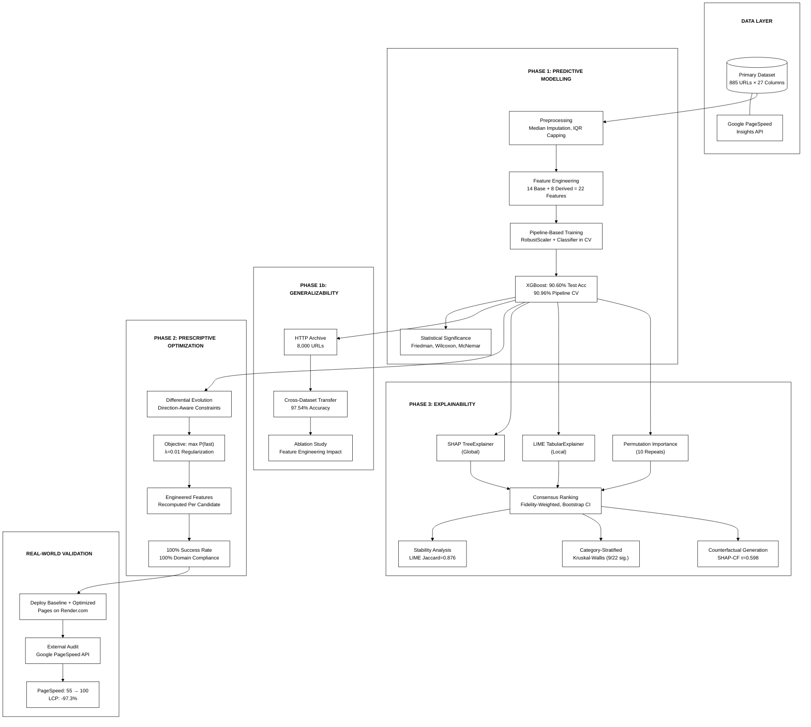
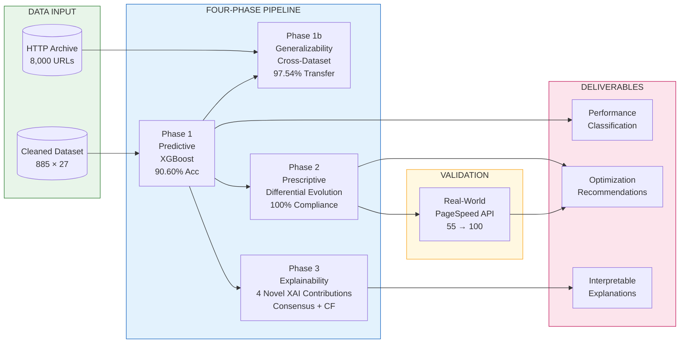
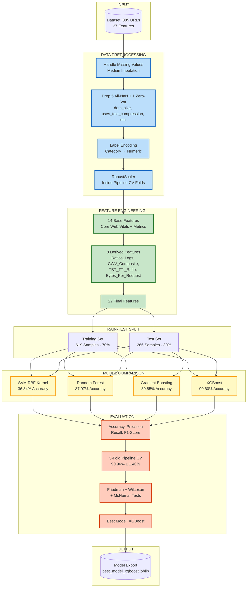
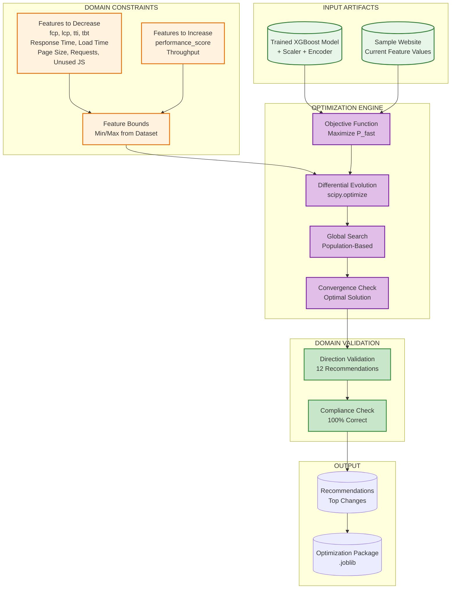
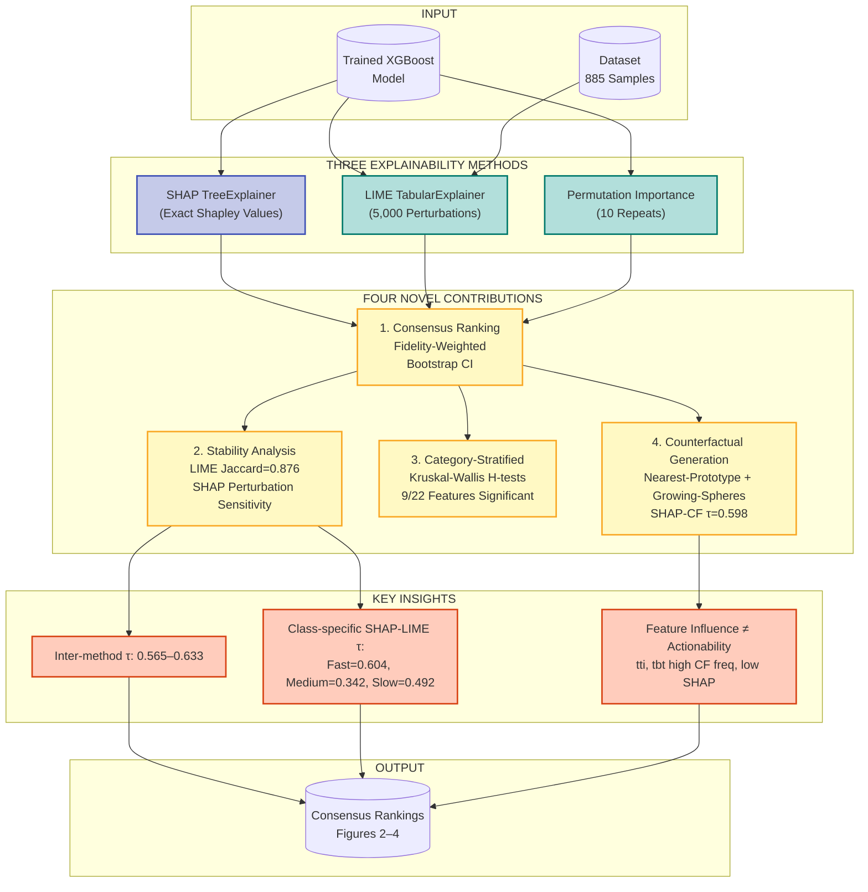
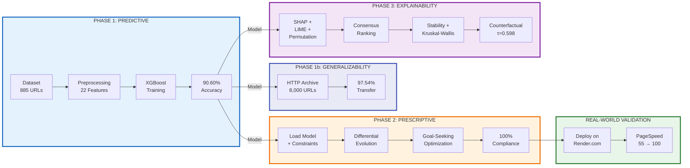
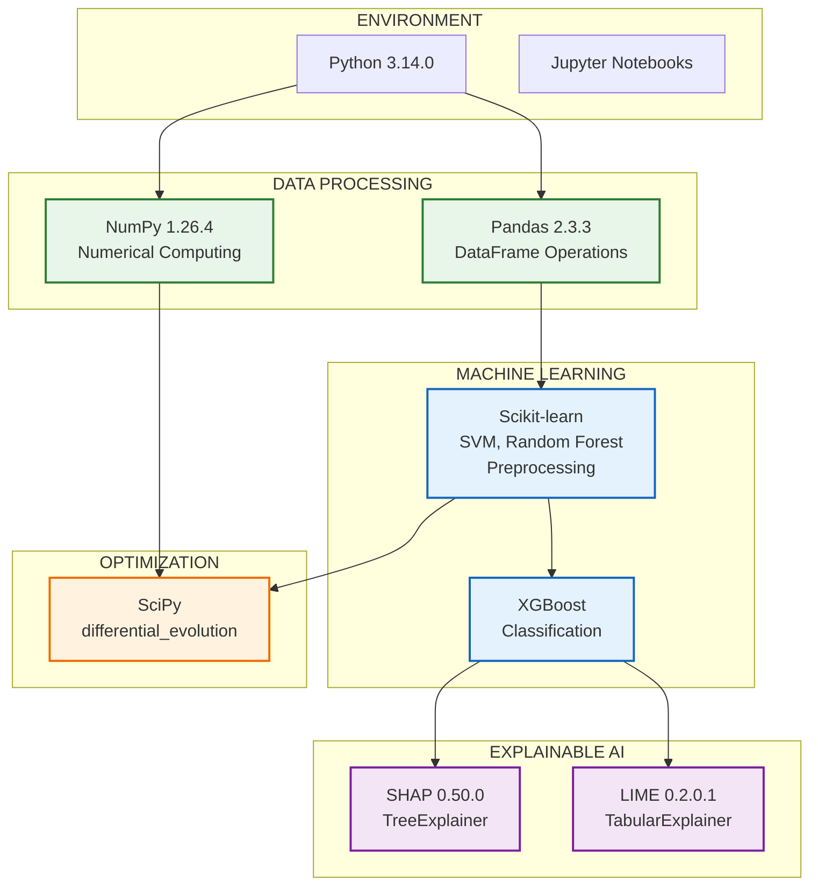
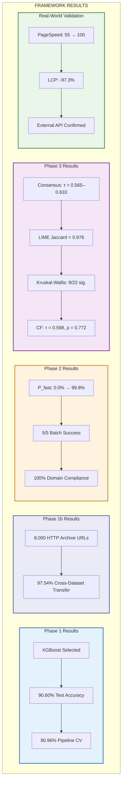

# System Architecture Diagrams
## Predictive-Prescriptive-Explainable AI Framework for Web Performance Optimization

---

## 1. Complete Framework Architecture

---

## 2. High-Level Data Flow Architecture

---

## 3. Phase 1: Predictive Model Architecture

---

## 4. Phase 2: Prescriptive Optimization Architecture

---

## 5. Phase 3: Explainability Architecture

---

## 6. Integrated System Flow (Research Paper Figure)

---

## 7. Technology Stack

---

## 8. Results Summary Diagram

---

## Usage Instructions for Research Paper

### Recommended Diagrams by Section:
| Paper Section | Recommended Diagram |
|--------------|---------------------|
| System Design / Methodology | Diagram 1 (Complete Framework) |
| High-Level Overview | Diagram 2 (Data Flow) |
| Phase 1 Details | Diagram 3 (Predictive Model) |
| Phase 2 Details | Diagram 4 (Prescriptive Optimization) |
| Phase 3 Details | Diagram 5 (Explainability) |
| Abstract / Introduction | Diagram 6 (Integrated Flow) |
| Implementation | Diagram 7 (Technology Stack) |
| Results | Diagram 8 (Results Summary) |

### Export Instructions:
1. **Online Tool**: Visit https://mermaid.live/
2. **Paste Code**: Copy any diagram code block
3. **Export**: Download as PNG or SVG (300 DPI for print)
4. **LaTeX**: Use `\includegraphics{diagram.png}` with appropriate sizing

### Color Scheme:
- **Phase 1 (Predictive)**: Blue tones (#e3f2fd, #1565c0)
- **Phase 2 (Prescriptive)**: Orange tones (#fff3e0, #ef6c00)
- **Phase 3 (Explainability)**: Purple tones (#f3e5f5, #7b1fa2)
- **Input/Output**: Green/Pink (#e8f5e9, #fce4ec)

---

*Document Version: 3.0*  
*Updated: March 2026*  
*Aligned with REWRITTEN_PAPER.txt and IMPLEMENTATION_SUMMARY.md*
