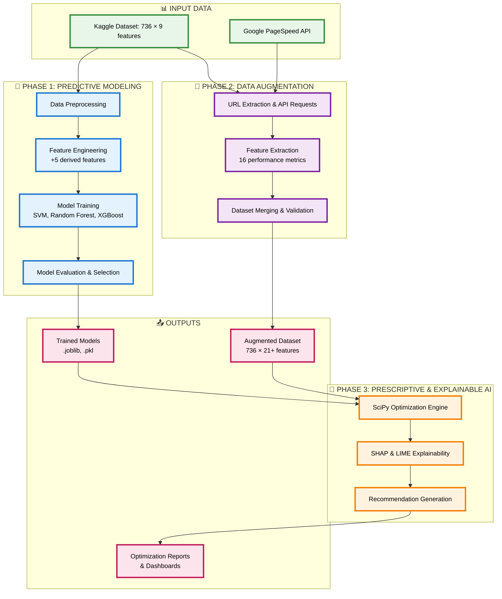
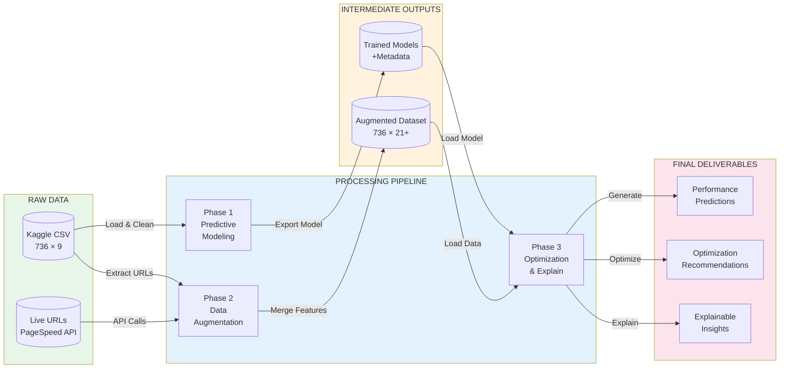
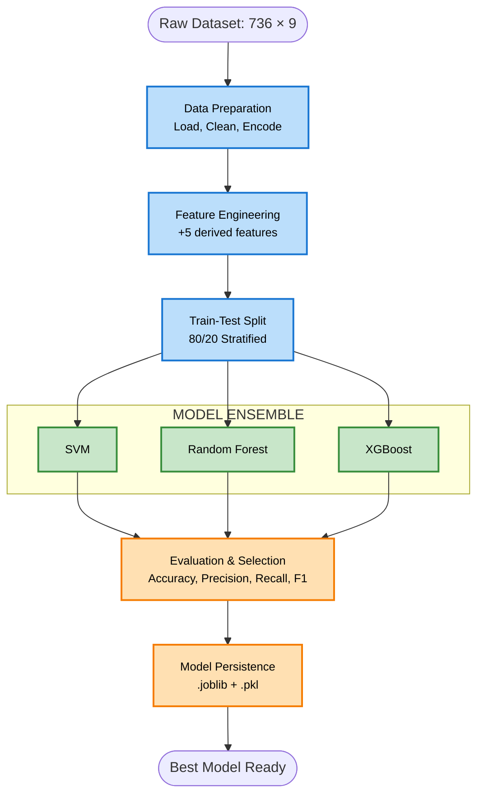
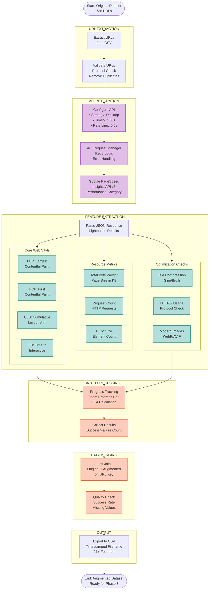
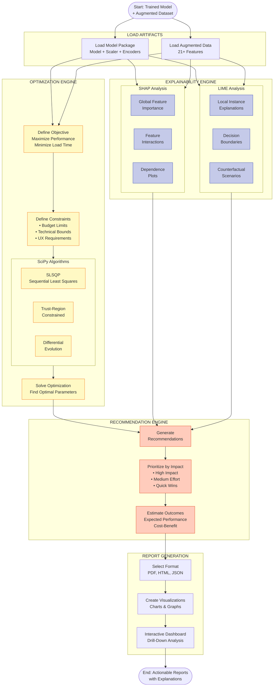
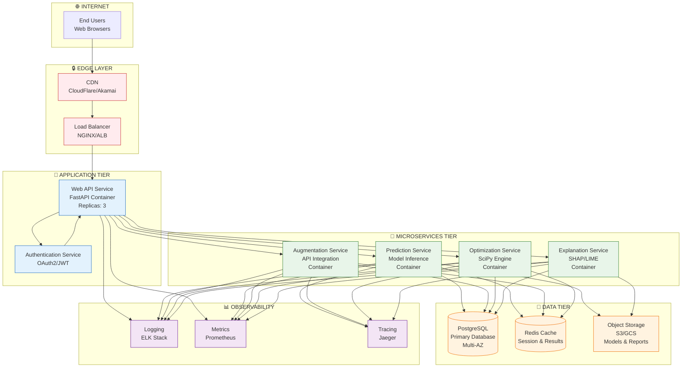
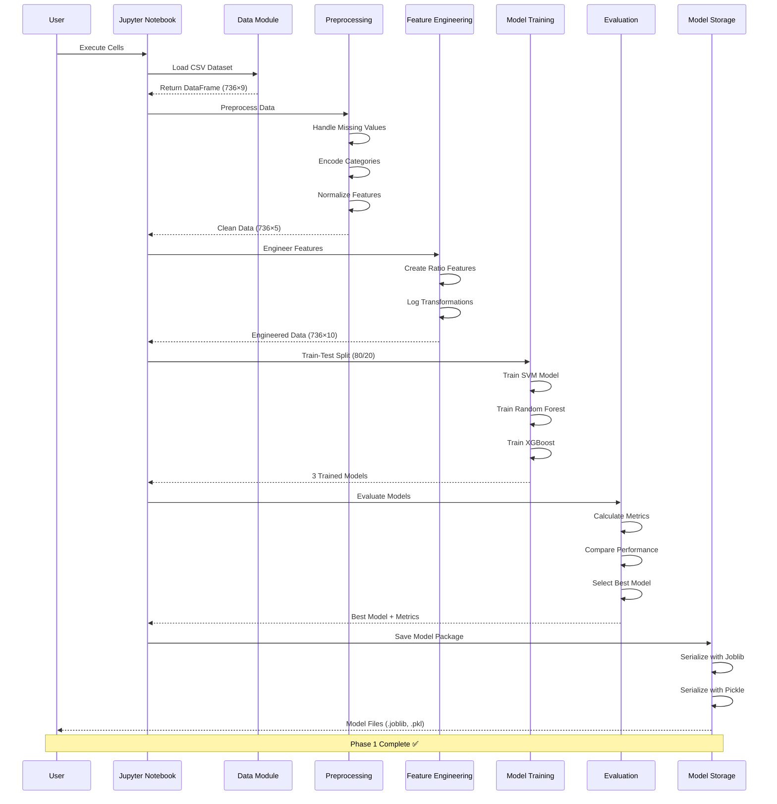
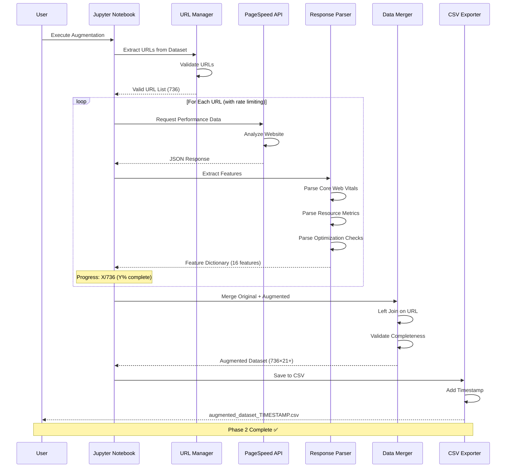
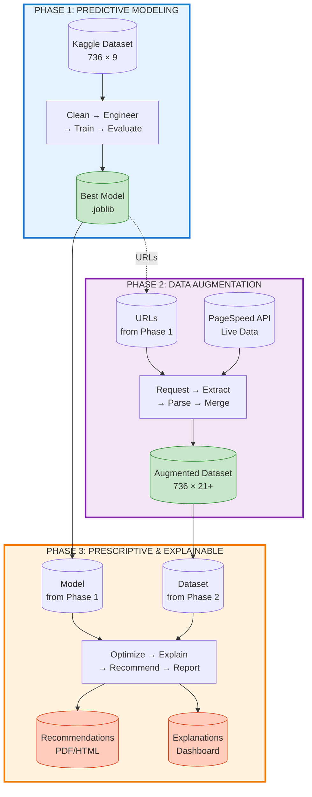

# High-Level System Architecture - Mermaid Diagrams

## 1. Complete System Architecture (Three-Phase Overview)



---

## 2. Data Flow Architecture



---

## 3. Phase 1: Predictive Modeling Detailed Architecture



---

## 4. Phase 2: Data Augmentation Detailed Architecture



---

## 5. Phase 3: Prescriptive & Explainable Architecture (Planned)



---

## 6. Technology Stack Architecture

```mermaid
graph TB
    subgraph Frontend["🎨 FRONTEND LAYER (Future)"]
        UI[Web UI<br/>React/Vue]
        Dashboard[Interactive Dashboard<br/>Plotly Dash]
    end

    subgraph Application["💻 APPLICATION LAYER"]
        Jupyter[Jupyter Notebooks<br/>Interactive Development]
        API[REST API<br/>FastAPI/Flask]
    end

    subgraph Processing["⚙️ PROCESSING LAYER"]
        ML[Machine Learning<br/>Scikit-learn, XGBoost]
        Opt[Optimization<br/>SciPy]
        Explain[Explainability<br/>SHAP, LIME]
    end

    subgraph Data["📊 DATA LAYER"]
        CSV[CSV Files<br/>Pandas]
        Models[Model Storage<br/>Joblib]
        Cache[Cache Layer<br/>Redis (Future)]
    end

    subgraph External["🌐 EXTERNAL SERVICES"]
        PSI[Google PageSpeed<br/>Insights API]
        Cloud[Cloud Storage<br/>S3/GCS (Future)]
    end

    subgraph Infrastructure["🏗️ INFRASTRUCTURE (Future)"]
        Docker[Containerization<br/>Docker]
        K8s[Orchestration<br/>Kubernetes]
        Monitor[Monitoring<br/>Prometheus/Grafana]
    end

    UI --> API
    Dashboard --> API
    API --> Jupyter
    Jupyter --> ML & Opt & Explain
    ML --> CSV & Models
    Opt --> CSV & Models
    Explain --> CSV & Models
    API --> PSI
    Models --> Cloud
    API --> Docker
    Docker --> K8s
    K8s --> Monitor

    classDef frontendStyle fill:#e1f5fe,stroke:#0277bd
    classDef appStyle fill:#f3e5f5,stroke:#6a1b9a
    classDef processStyle fill:#e8f5e9,stroke:#2e7d32
    classDef dataStyle fill:#fff3e0,stroke:#ef6c00
    classDef externalStyle fill:#fce4ec,stroke:#c2185b
    
    class UI,Dashboard frontendStyle
    class Jupyter,API appStyle
    class ML,Opt,Explain processStyle
    class CSV,Models,Cache dataStyle
    class PSI,Cloud externalStyle
```

---

## 7. Deployment Architecture (Future Cloud-Native)



---

## 8. Model Training Pipeline Architecture



---

## 9. Data Augmentation Pipeline Architecture



---

## 10. System Integration and Data Flow (Complete)



---

## Usage Instructions

### For Dissertation Report:
1. Copy the main "Complete System Architecture" diagram (Section 1)
2. Include the "Data Flow Architecture" (Section 2) for high-level overview
3. Add phase-specific diagrams (Sections 3-5) in detailed design chapters
4. Use the "Technology Stack" (Section 6) in implementation chapter
5. Include "Deployment Architecture" (Section 7) in future work section

### Rendering Mermaid Diagrams:
- **In Markdown viewers**: GitHub, GitLab, VS Code with Mermaid extension
- **Online**: https://mermaid.live/ (paste code and export as PNG/SVG)
- **In LaTeX**: Export as SVG/PNG and include as figures
- **In PowerPoint**: Export as images from mermaid.live

### Customization:
- Colors can be adjusted in `classDef` declarations
- Node shapes: `[]` rectangles, `()` rounded, `{}` rhombus, `[()]` stadium
- Arrow types: `-->` solid, `-.->` dotted, `==>` thick
- Subgraph styling for grouping related components

---

**Document Version**: 1.0  
**Created**: November 20, 2025  
**Format**: Mermaid.js Diagram Code  
**Compatible**: GitHub, GitLab, VS Code, mermaid.live
